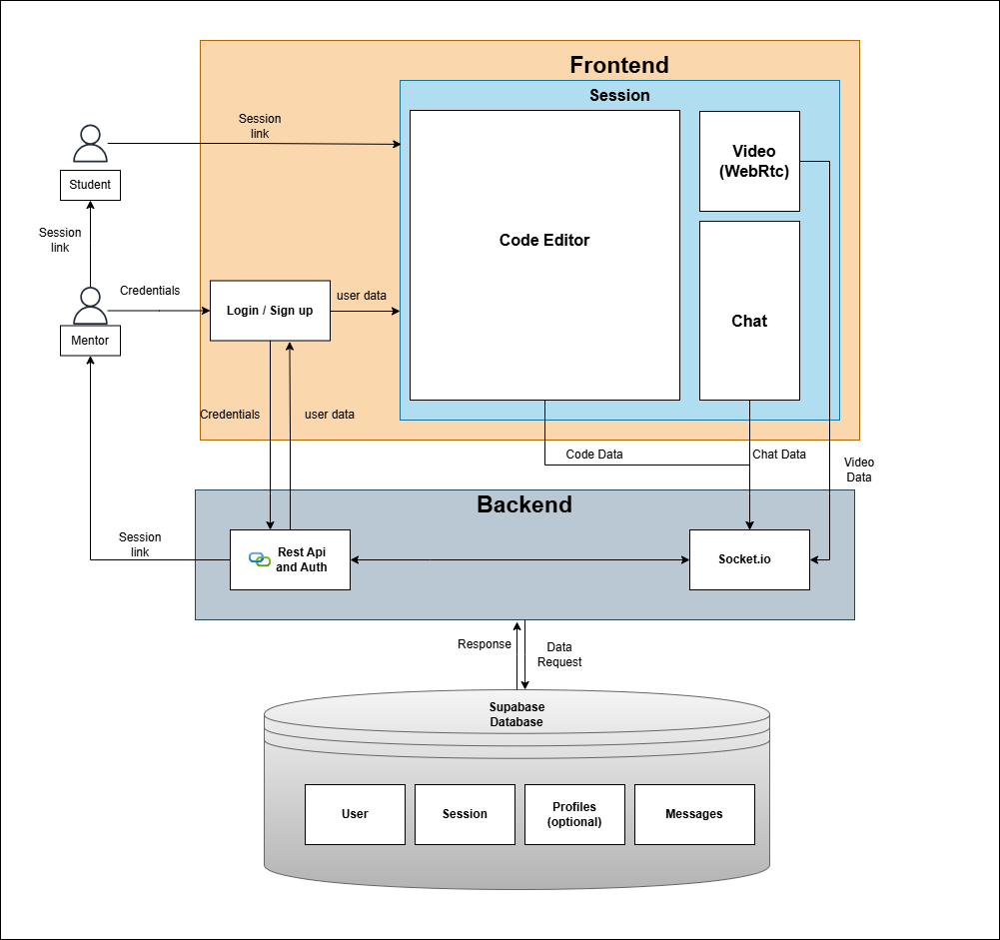

# Mentor Bridge

## Goal
Design and develop a secure, real-time 1-on-1 mentorship platform that enables mentors
and students to collaborate effectively through live video communication, real-time chat, and
shared code editing within a controlled session-based environment.

## Collaboration tools using modern full-stack technologies
1. Next.js  - Frontend
2. Tailwindcss - Designing
3. Node.js, Express.js - Backend
4. WebRTC → media transmission (audio/video)
5. Socket.io → signaling + real-time messaging
6. Supabase - Database

## Architecture Design

## Features

1. Authentication & Roles:
	I. Secure authentication using Supabase Auth.
	II. Protected routes.

2. Real-Time Communication:
	I. WebRTC for peer-to-peer video & audio calls.
	II. Socket-based signaling.

3. Collaborative Code Editor:
	I. Monaco Editor.
	II. Real-time code synchronization.
	III. Support for Python.

4. Messaging System:
	Session-based Chat (Socket.io).

5. Session Management:
	I. Create Sessions (Mentor) and Join sessions via link (Student).
	II. Tracking of Active Session.

## Use Cases
1. Career Changers.
2. Individual and Distance learners.
3. Tutoring Platform.

## Tasks Performed by Members
- Harshit Kumar - Frontend
- Vijaya Lakshmi - WebRtc for Video Call, Messaging System, and Authentication
- Ashish Biswas - Session Management, Collaborative Code Editor and basic user functionality

---

### Getting started
- Install dependencies: `npm install`
- Run the development server: `npm run dev`
- Visit `http://localhost:3000`

### Project structure (high level)
- `app/` – Next.js routes, including grouped auth pages.
- `components/` – Reusable UI and layout building blocks.
- `util/` – Backend utilities (Supabase clients, helpers).
